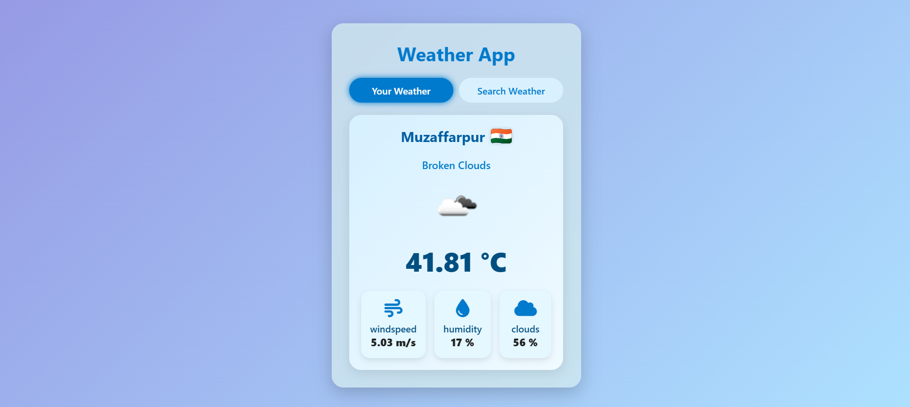

# 🌤️ Weather App

A beautiful, responsive, and interactive weather application built with HTML, CSS, and JavaScript. It fetches real-time weather data based on user location or manual city input using the OpenWeatherMap API.

---

## 🔧 Features

- 📍 Get weather data based on your **current location**
- 🔍 Search weather by **city name**
- 🌡️ Display of **temperature, humidity, wind speed, and cloud coverage**
- 🎨 **Modern and responsive UI** with animated background and icon-based visual design
- ⚡ Real-time API integration and **loading animations**
- 🌓 Toggle between **Your Weather** and **Search Weather** seamlessly

---

## 🚀 Technologies Used

- HTML5 & CSS3 (with Flexbox & gradients)
- JavaScript
- Font Awesome for icons
- OpenWeatherMap API

---

